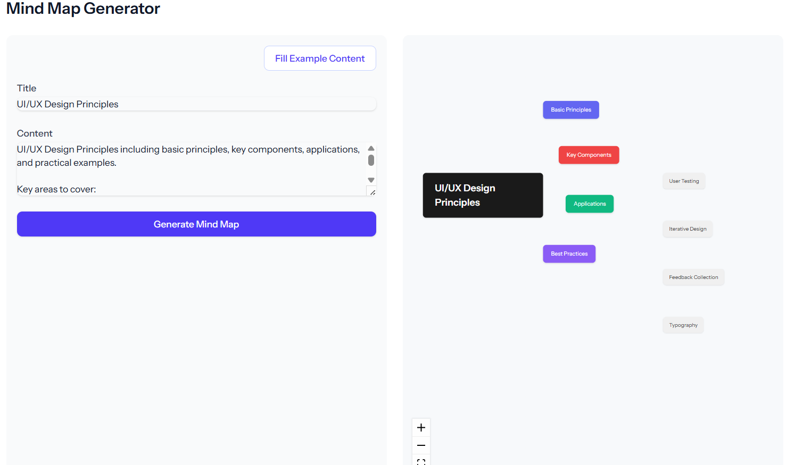

# Interactive Mind Map Component

A beautiful and interactive mind map visualization component built with React and ReactFlow.



## Features

- 🎨 Modern UI with smooth animations and transitions
- 🔄 Interactive node dragging and connection creation
- 📱 Responsive design with fullscreen support
- 🎯 Automatic edge creation when nodes are dragged close
- 🌈 Beautiful color gradients and visual hierarchy
- 🔍 Zoom and pan controls
- 💫 Animated connections for primary nodes

## Node Types

The mind map supports three levels of nodes with distinct styling:

1. **Root Node (Level 0)**

    - Larger size (80px)
    - Dark gradient background
    - Bold text with larger font size

2. **Primary Nodes (Level 1)**

    - Medium size (70px)
    - Colorful gradient backgrounds
    - Animated connections to root

3. **Secondary Nodes (Level 2)**
    - Standard size (60px)
    - Light background with colored borders
    - Subtle connections

## Usage

```tsx
import MindMapViewer from '@/components/MindMap/MindMapViewer';

// Your mind map data structure
const mindMapData = {
    structure: {
        nodes: [
            {
                title: "Root",
                description: "Root node description",
                children: [
                    {
                        title: "Child 1",
                        description: "Child 1 description",
                        children: [...]
                    },
                    // More children...
                ]
            }
        ]
    }
};

// Use the component
function YourComponent() {
    return (
        <MindMapViewer data={mindMapData} />
    );
}
```

## Interactions

- **Drag Nodes**: Click and drag nodes to reposition them
- **Create Connections**: Drag nodes close to each other to create connections
- **Zoom**: Use mouse wheel or zoom controls
- **Pan**: Click and drag the canvas
- **Fullscreen**: Toggle fullscreen mode with the expand button
- **Reset View**: Use the reset button in controls to fit all nodes

## Styling

The component uses a combination of Tailwind CSS and custom styles. The main styling files are:

- `MindMapViewer.css`: Custom styles for nodes, edges, and controls
- Inline styles for dynamic node appearance

## Dependencies

- React
- ReactFlow / XY Flow
- Tailwind CSS

## Development

1. Install dependencies:

```bash
npm install
```

2. Import required styles:

```tsx
import 'reactflow/dist/style.css';
import '@xyflow/react/dist/style.css';
```

3. Customize node styles in the `getNodeStyle` function
4. Adjust layout parameters in `processInitialNodes`

## License

MIT License
